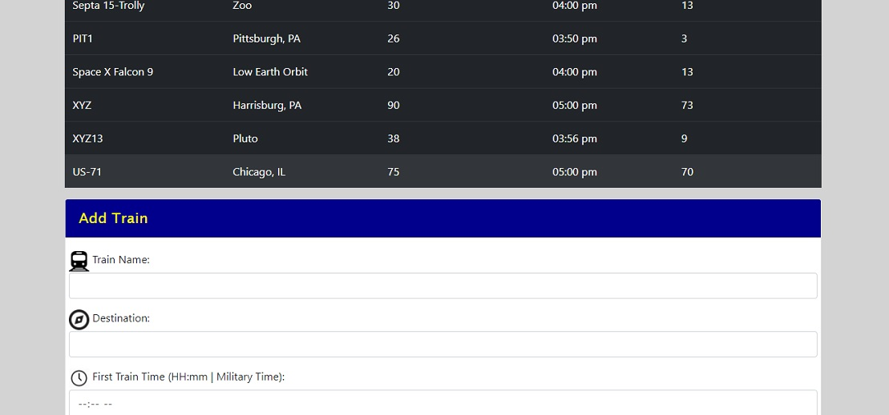

# Firebase Train Station Schedule Board

In this project, we were asked to build a real-time, database application for a train station schedule board that will have the availability to be updated, and added to, instantaneously using form inputs and an external Firebase database.  It has the ability for users (or admin) to add a new train and its destination, the frequency of the train, the next arrival time, and also list how many minutes until that next train would arrive.  That information is added and saved to the external database and also is updated on the board as well.
___

___

___

Setting up the HTML and CSS was done mainly by using Bootstrap to layout the title area, the table form for the train information, and a form for the admin to add a new train.  This was fairly easy to layout using Bootstrap, and the header, colors and final layout aspects were added through Photoshop and a linked external CSS page.  Then a linked Javascript and jQuery file was used to configure and initialize the interactivity with the Firebase database, to take the information of the added train and push it to our database, and update the application in real time.  One aspect that was a little buggy to implement was using the MomentJS framework to calculate the train time and frequency, and then using a formula to calculate the minutes until the next train, as well as the next time that train would arrive.

___

___

___

___

One other aspect that I found to be slightly difficult was in the form we had been asked to have the user input the train time in military time, but talking with another colleague, he had suggested to instead taking the input as "time", input it as a string or "text" and then parsing it to a time format on the back end.  I did try to work that into my page but in the end I kept it as is because the user will input the train time in AM/PM time, it will convert it to 24-hour time in the code, and then I formatted the output in our table back to a normal 12-hour AM/PM layout.  In the future I will look further into the time formatting and different types of input that HTML can provide.  The last aspect I had added that took a little bit of time was adding the current time to the page, but using the MomentJS library I was able to format it correctly to the top of the table.  Also, in the future I would like to delve deeper into adding a login option for users and admin, and also adding the ability to remove a train from the train database.  But feel free to add a train and watch it show up on the board!

### Getting Started & Prerequisites

To install or use this application, the only prerequisite would be to navigate to the hosted page through GitHub here below, or to clone the repo and open the index.html page on the user's local machine.  The CSS and JavaScript page are linked to the HTML page and will run on its own.

## Built With

* [HTML] - Front End Design
* [Bootstrap](https://getbootstrap.com/docs/4.3/layout/overview/) - Front End Design
* [CSS3] - Front End Design
* [JavaScript] - Added Interactivity
* [jQuery] - Added Interactivity
* [Firebase Database](https://firebase.google.com/) - Used to generate and maintian database
* [Moment JS](https://momentjs.com/) - Parse, validate, manipulate, and display dates and times in JavaScript

## Authors

* **Matt Williams** - *Initial work* - [M Williams Portfolio](https://mattwills09.github.io/portfolio.html)
